# Autodarts Turnieje Zasadinho

Lokalny turniej bezpośrednio w `https://play.autodarts.io` jako Userscript.

Asystent rozszerza interfejs Autodarts o własny panel zawierający:
- tworzenie turnieju (KO, Liga, Faza grupowa + KO)
- prowadzenie wyników
- widok turnieju (tabela + drabinka)
- import/eksport
- półautomatyczną obsługę API (start jednym kliknięciem + synchronizacja wyników)

## Spis treści
1. [Dokumentacja](#dokumentacja)
2. [Szybki start (zalecane)](#szybki-start-zalecane)
3. [Pierwsze kroki w Autodarts](#pierwsze-kroki-w-autodarts)
4. [Funkcje](#funkcje)
5. [Tryby turniejowe](#tryby-turniejowe)
6. [Utwórz turniej](#utwórz-turniej)
7. [Półautomatyka API](#półautomatyka-api)
8. [Drabinka turniejowa](#drabinka-turniejowa)
9. [Import i eksport](#import-i-eksport)
10. [Ustawienia](#ustawienia)
11. [Podstawa zasad i limity](#podstawa-zasad-i-limity)
12. [Rozwiązywanie problemów](#rozwiązywanie-problemów)
13. [Rozwój](#rozwój)
14. [Ograniczenia](#ograniczenia)
15. [Źródła](#źródła)

## Dokumentacja
Dodatkowa dokumentacja dotycząca obliczania czasu:  
[docs/tournament-duration.md](docs/tournament-duration.md)

| Dokument | Zawartość | Dla kogo |
|---|---|---|
| [docs/codebase-map.md](docs/codebase-map.md) | Pełna techniczna mapa kodu: logika folderów, role plików, przepływ build/runtime, diagramy | Deweloperzy / Maintainerzy |
| [docs/architecture.md](docs/architecture.md) | Kompaktowy przegląd warstw, persystencji, logiki KO, runtime i jakości | Deweloperzy / osoby techniczne |
| [docs/refactor-guide.md](docs/refactor-guide.md) | Zasady zmian, granice modułów, zalecany proces build/QA | Deweloperzy wprowadzający zmiany |
| [docs/selector-strategy.md](docs/selector-strategy.md) | Strategia selektorów DOM dla automatycznego przejmowania wyników | Deweloperzy od Autodetect/API |
| [docs/pdc-dra-compliance.md](docs/pdc-dra-compliance.md) | Przegląd, które punkty PDC/DRA są zaimplementowane | Logika turniejowa / reguły |
| [docs/dra-compliance-matrix.md](docs/dra-compliance-matrix.md) | Szczegółowa matryca mapowania reguł, profili tie-break i migracji | Deweloperzy / przegląd reguł |
| [docs/dra-regeln-gui.md](docs/dra-regeln-gui.md) | Wyjaśnienia reguł powiązane z GUI (linki informacyjne w aplikacji) | Użytkownicy / prowadzący turniej / deweloperzy |
| [docs/changelog.md](docs/changelog.md) | Historia wydań i zmian funkcjonalnych | Użytkownicy / deweloperzy |

## Szybki start (zalecane)
Instrukcja instalacji w stylu „Szybki start (zalecane)” znanego z motywów Autodarts:

1. Zainstaluj Tampermonkey w swojej przeglądarce.
2. Zainstaluj Loader (zalecane):
   - `https://github.com/Zasadinho/Autodart_Turnieje/raw/refs/heads/dart/installer/Autodarts%20Turnieje%20Zasadinho%20Instalacja.user.js`
3. Odśwież stronę `https://play.autodarts.io`.
4. W lewym menu kliknij **Lokalny Turniej**.

Jeśli Tampermonkey nie wstrzykuje skryptu na `play.autodarts.io`:
- FAQ Tampermonkey: https://www.tampermonkey.net/faq.php#Q209

Alternatywa bez Loader’a (bezpośrednio skrypt runtime):
- `https://github.com/Zasadinho/Autodart_Turnieje/raw/refs/heads/dart/dist/autodarts-turnieje-asystent.user.js`

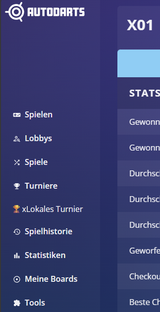

## Pierwsze kroki w Autodarts
Po instalacji w lewym menu głównym pojawi się nowa pozycja. Kliknięcie jej otwiera Asystenta z zakładkami:
- `Turniej`
- `Mecze` 
- `Drabinka` 
- `Import/Export`
- `Ustawienia` 

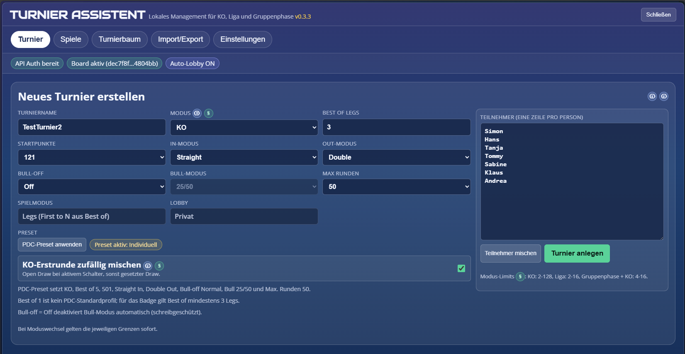

## Funkcje
- Tryby turniejowe:
  - `ko`
  - `league`
  - `groups_ko`
- Prowadzenie wyników:
  - Ręczne zapisywanie wyników każdego meczu
  - Start meczu przez API jednym kliknięciem
  - Automatyczna synchronizacja wyników przez API
  - Przycisk inline na `/history/matches/{id}`:
    `Przejęcie wyniku ze statystyk & otwórz turniej`
- Widok KO:
  - Drabinka przez `brackets-viewer` (domyślnie)
  - HTML-fallback przy błędzie CDN lub timeout
- Tworzenie turnieju:
  - Pierwsza runda KO jako hybrid-draw (`seeded` lub `open_draw`)
  - Wybór presetów: oficjalny European Tour, profil Basic, tryb własny
  - Kompaktowy formularz (konfiguracja + lista uczestników)
  - Live-prognoza **Przewidywanego czasu trwania turnieju**
  - Lista uczestników może być mieszana jednym kliknięciem
  - Szkic formularza jest zachowywany (np. przy zmianie trybu)
- Import/Eksport:
  - Eksport do pliku JSON
  - Kopiowanie JSON do schowka
  - Import z pliku lub wklejonego tekstu JSON

## Tryby turniejowe
| Tryb | Opis | Typowe zastosowanie |
|---|---|---|
| `ko` | Klasyczna drabinka single-elimination | Szybki turniej z rundą finałową |
| `league` | Każdy z każdym (Round Robin) | Mała grupa z pełną tabelą |
| `groups_ko` | 2 grupy, następnie faza KO | Połączenie fazy grupowej i finałowej |

### KO (`ko`)
- Hybrid-Draw:
  - `Losowo wymieszaj pierwszą rundę KO = OFF` → `seeded` (kolejność wpisania = seedy 1..n)
  - `Losowo wymieszaj pierwszą rundę KO = ON` → `open_draw` (deterministycznie wymieszane seedy)
- Rozdawanie wolnych losów (Bye) zgodne z PDC/DRA:
  - Jeśli liczba graczy nie jest potęgą 2, najwyższe seedy otrzymują wolne losy.
  - Przykład: 9 graczy w drabince 16 — tylko Seed 8 vs Seed 9 gra w rundzie 1.
- Mecze KO są odblokowywane zgodnie z przebiegiem drabinki:
  - Mecz można rozegrać, gdy obaj uczestnicy są już znani.
  - W rundach > 1 wymagane jest zakończenie poprzednich meczów.
- Tylko wolne losy z rundy 1 mogą być automatycznie oznaczone jako zakończone.
- W zakładce `Mecze` mecze są oznaczane jako `Wolny los`.

### Liga (`league`)
- Pełny harmonogram Round Robin.
- Tabela opiera się na:
  - punktach
  - bezpośrednim pojedynku (przy 2 równych punktowo, zgodnie z DRA)
  - różnicy legów w podgrupie (przy 3+ równych punktowo, zgodnie z DRA)
  - różnicy legów ogólnej
  - liczbie wygranych legów
  - przy dalszym remisie: `Wymagany playoff`

### Faza grupowa + KO (`groups_ko`)
- Dwie grupy (`A`, `B`).
- Top-2 z każdej grupy awansuje do fazy KO.
- Półfinały krzyżowe:
  - `A1 vs B2`
  - `B1 vs A2`
- Po półfinałach rozgrywany jest finał.

## Utwórz turniej
Zakładka: `Turniej`


### Pola obowiązkowe
- Nazwa turnieju
- Tryb
- Uczestnicy (jedna linia na osobę)

### Pola i opcje formularza (wraz z wyjaśnieniem)
| Pole | Opcje / wartości | Co kontroluje | Dlaczego to ważne |
|---|---|---|---|
| `Nazwa turnieju` | Dowolny tekst | Nazwa aktywnej sesji / eksportu | Ułatwia rozróżnianie wielu lokalnych turniejów |
| `Tryb` | `KO`, `Liga`, `Faza grupowa + KO` | Logika harmonogramu, tabel, ścieżek KO | Zły tryb = zła liczba meczów i błędny przebieg turnieju |
| `Best of Legs` | Nieparzyste `1..21` | Długość meczu; wewnętrznie `First to N` | Określa warunek zwycięstwa i wpływa na czas trwania turnieju |
| `Punkty startowe` | `121`, `170`, `301`, `501`, `701`, `901` | Bazowy tryb X01 dla każdego meczu | Wpływa na czas meczu i poziom trudności |
| `In mode` | `Straight`, `Double`, `Master` | Jak rozpoczyna się leg | Określa wymagania startowe zgodnie z zasadami gry |
| `Out mode` | `Straight`, `Double`, `Master` | Jak kończy się leg | Kluczowa zasada dotycząca checkoutu |
| `Bull-off` | `Off`, `Normal`, `Official` | Zachowanie bull-off / ustalanie kto zaczyna | Definiuje sposób wyboru rozpoczynającego |
| `Tryb bulla` | `25/50`, `50/50` | Punktacja segmentów bull | Musi być zgodna z zasadami lokalnymi / formatem turnieju |
| `Max Rund` | `15`, `20`, `50`, `80` | Górny limit długości meczu w lobby | Zapobiega zaciętym lub zbyt długim meczom |
| `Tryb gry` | stałe `Legs (First to N na podstawie Best of)` | Nie można zmienić w UI | Chroni przed niespójnymi kombinacjami ustawień |
| `Lobby` | stałe `Prywatny` | Widoczność lobby API | Lokalny turniej pozostaje prywatny i bezpieczny |
| `Preset` | Lista + przycisk `Zastosuj preset` | Ustawia wszystkie pola zgodne z presetem | Oddziela oficjalne profile od kompatybilnych i własnych |
| `Losowo wymieszaj pierwszą rundę KO` | Checkbox `ON/OFF` | `open_draw` lub `seeded` w rundzie 1 | Jasny wybór między losowaniem a rozstawieniem |
| `Uczestnicy` | Jedna osoba na linię | Lista uczestników + kolejność | Przy `seeded` kolejność = seedy |
| `Uczestnicy losowo` | Przycisk | Miesza listę uczestników | Przydatne przy spontanicznym losowaniu |

### Katalog presetów
- Przy tworzeniu nowego turnieju domyślnie aktywny jest preset `PDC European Tour (Official)`.
- Preset stosuje się przez wybór + przycisk `Zastosuj preset`, który ustawia wszystkie powiązane pola.
- Tryb gry zawsze pozostaje `Legs`; `Best of Legs` definiuje długość meczu i jest w API odwzorowane jako `First to N Legs`.

| Preset | Parametry | Uwagi |
|---|---|---|
| `PDC European Tour (Official)` | `KO`, `Best of 11`, `501`, `Straight In`, `Double Out`, `Bull 25/50`, `Bull-off Normal`, `Max Rund 50`, `Lobby prywatne` | Oficjalny domyślny format rund. `Bull-off Normal` i `Max Rund 50` to wartości techniczne Autodarts; `Max Rund` **nie** jest oficjalną zasadą PDC. |
| `PDC 501 / Double Out (Basic)` | `KO`, `Best of 5`, `501`, `Straight In`, `Double Out`, `Bull 25/50`, `Bull-off Normal`, `Max Rund 50`, `Lobby prywatne` | Uczciwie nazwany profil kompatybilności dla wcześniejszego, mylącego `PDC Standard`. **Nie** jest to oficjalny format turniejów PDC. |
| `Indywidualny / Manuell` | aktualne wartości formularza | Status po ręcznej zmianie pól powiązanych z presetem. |

### Niewłączone formaty PDC
- `PDC World Championship` **nie** jest dostarczany jako oficjalny preset.
- Powód:
  - Format opiera się na `Setach` (Best of Sets; jeden set = `Best of 5 Legs`).
  - Integracja AutoDarts/ATA obsługuje tylko `Legs / First to N`.
- Dlatego aplikacja **nie udaje** pełnego formatu Mistrzostw Świata.

### Zachowanie formularza
- Formularz zapisuje szkic (draft).
- Dzięki temu dane pozostają zachowane nawet gdy:
  - zmienisz tryb turnieju
  - UI zostanie ponownie wyrenderowane
- Jeśli `Bull-off = Off`, pole `Tryb bulla` staje się automatycznie tylko do odczytu.
- Po ręcznej zmianie pól powiązanych z presetem status zmienia się na `Indywidualny`.
- Starsze szkice i turnieje z presetem `pdc_standard` są automatycznie mapowane na `PDC 501 / Double Out (Basic)`, aby zapisane turnieje `Best of 5` nie zmieniały się po cichu na `Best of 11`.

### Przewidywany czas trwania turnieju
- Szczegóły dotyczące formuły, czynników i podstaw benchmarku: [docs/tournament-duration.md](docs/tournament-duration.md)
- W prawej kolumnie, pod sekcją `Uczestnicy`, wyświetlana jest prognoza w czasie rzeczywistym.
- Obliczenia aktualizują się przy każdej zmianie w formularzu:
  - liczba uczestników i tryb
  - `Best of Legs`
  - `Punkty startowe`
  - `In mode`, `Out mode`
  - `Bull-off`, `Tryb bulla`
  - `Max Rund`
- Prognoza pokazuje:
  - wartość główną `ok. Xh Ym`
  - realistyczny przedział czasowy
  - liczbę zaplanowanych meczów
  - średni czas jednego meczu
- Założenie:
  - turniej rozgrywany na jednym boardzie (Single-Board-Flow)
- Globalna kalibracja odbywa się przez profil czasowy w zakładce `Ustawienia`.

Przykład prognozy czasu w formularzu turnieju:


Widok łączy liczbę uczestników, liczbę meczów, średni czas meczu, aktywny profil czasowy oraz realistyczny przedział — wszystko w jednym, kompaktowym podsumowaniu.

### Po utworzeniu turnieju
W aktywnym turnieju od razu zobaczysz najważniejsze informacje:
- Format (`KO`, `Liga`, `Faza grupowa + KO`)
- `Best of`, `First to`, `Punkty startowe`
- W KO: `Open Draw` / `Losowanie z rozstawieniem`, `Draw-Lock aktywny/wyłączony`
- Podsumowanie X01 oraz „chipsy” uczestników

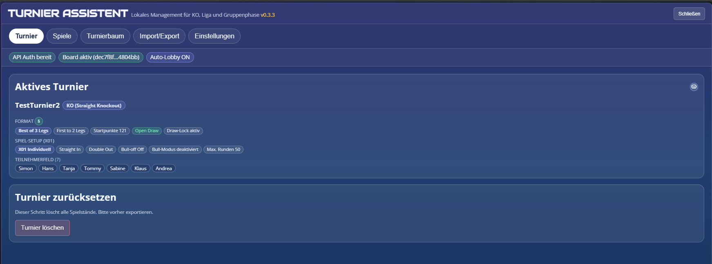

## Półautomatyka API
Zakładka: `Spiele` (Gry)

### Wymagania
- Ważny login Autodarts (Auth-Token)
- Aktywny board w Autodarts
- Włączona opcja `Automatyczny start lobby + synchronizacja API`

### Przebieg
1. Uruchom mecz w zakładce `Spiele` przyciskiem `Uruchom mecz`.
2. Tworzona jest lobby z ustawieniami turnieju (pola X01 + Legs z `Best of Legs`), zawsze jako lobby prywatne.
3. Gracze są dodawani, a mecz zostaje automatycznie rozpoczęty.
4. Wynik jest pobierany przez API i zapisywany lokalnie.
5. Na stronie statystyk (`/history/matches/{id}`) dostępny jest dodatkowy przycisk do bezpośredniego importu wyniku.

### Sortowanie wyników i statusy
W zakładce `Spiele` (Gry) mecze są grupowane i sortowane według logiki turniejowej:

Segmenty sortowania:
- `Rozgrywane jako pierwsze` — priorytet dla meczów, które można rozpocząć od razu (najbardziej praktyczne w realnym przebiegu turnieju).
- `Runda/Mecz` — ścisła kolejność zgodna ze strukturą turnieju.
- `Status` — grupowanie według: otwarte / zakończone / wolny los.

Ważne oznaczenia:
- `Nächstes Match` — sugerowany kolejny mecz do rozegrania (odpowiednik PDC „Next Match”).
- `Freilos (Bye)` — automatyczny awans bez gry.
- `Finale` — mecz finałowy.
- `Champion` — zwycięzca turnieju wraz z wynikiem legów.

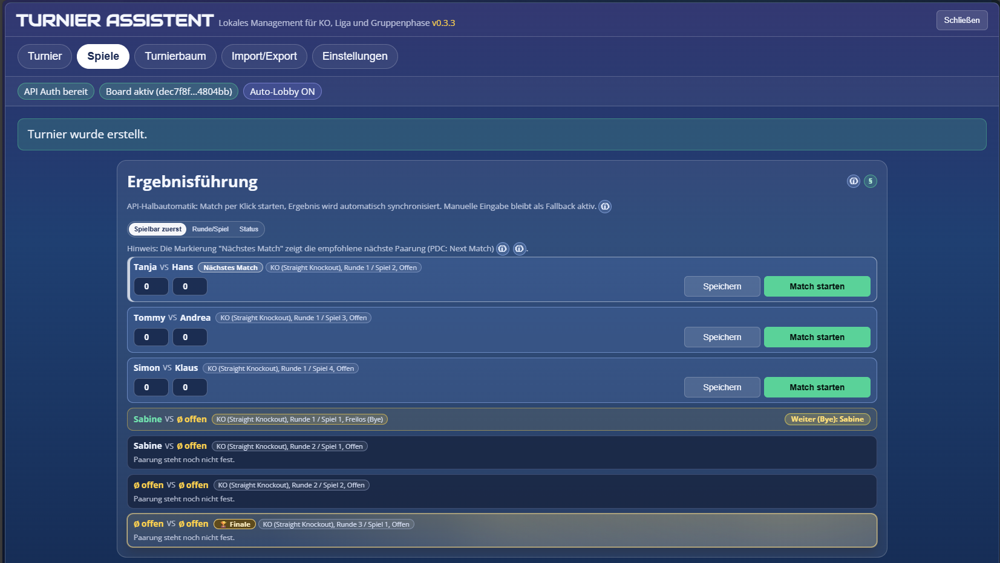

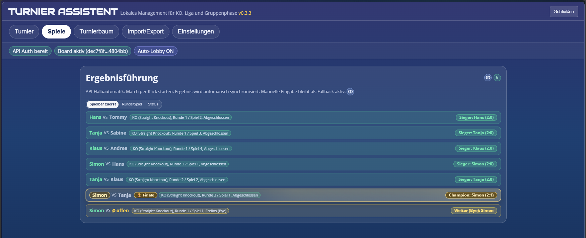

### Import statystyk z historii meczów
Na stronie `/history/matches/{id}` dostępny jest przycisk umożliwiający bezpośrednie przejęcie wyniku:

- Przycisk: `Ergebnis aus Statistik übernehmen & Turnier öffnen`
- Wyświetlany jest status (gotowość importu, ostatnia synchronizacja, ewentualne błędy)
- Po imporcie otwierana jest zakładka `Spiele`


### Mechanizmy ochronne
- Tylko jeden aktywny mecz API jednocześnie (Single-Board-Flow).
- Zduplikowane nazwy graczy blokują synchronizację API.
- Nieprawidłowe wyniki są odrzucane.
- Przy niejednoznacznych dopasowaniach wynik **nie** jest przejmowany automatycznie — celowo, aby uniknąć błędów.

## Drabinka turniejowa
Zakładka: `Turnierbaum`

- Drabinka KO renderowana jest w iframe za pomocą `brackets-viewer`.
- W przypadku problemów z CDN wyświetlany jest fallback HTML.
- Wolne losy, zakończone mecze i finał są odpowiednio oznaczone.
- W zależności od trybu zakładka pokazuje różne widoki:
  - `KO`: klasyczna drabinka z otwartymi slotami, wolnymi losami i finałem.
  - `Liga`: tabela + pełny harmonogram meczów.
  - `Faza grupowa + KO`: tabele grupowe u góry, drabinka KO poniżej.

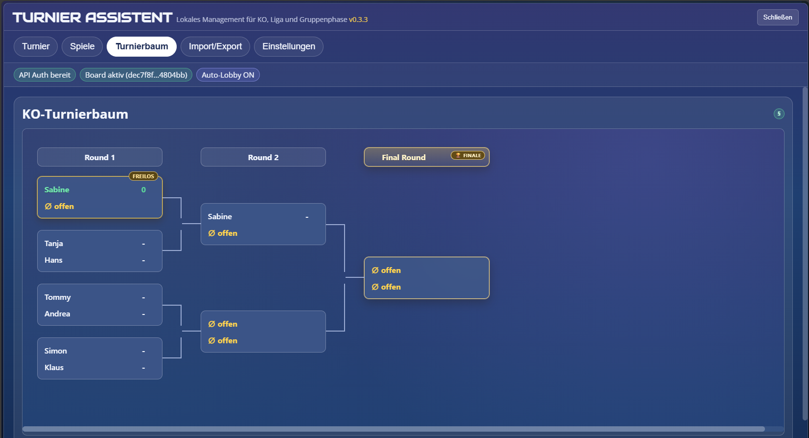
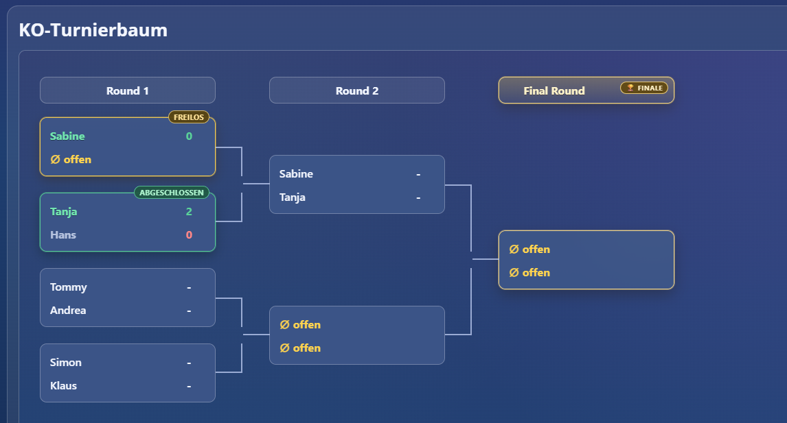
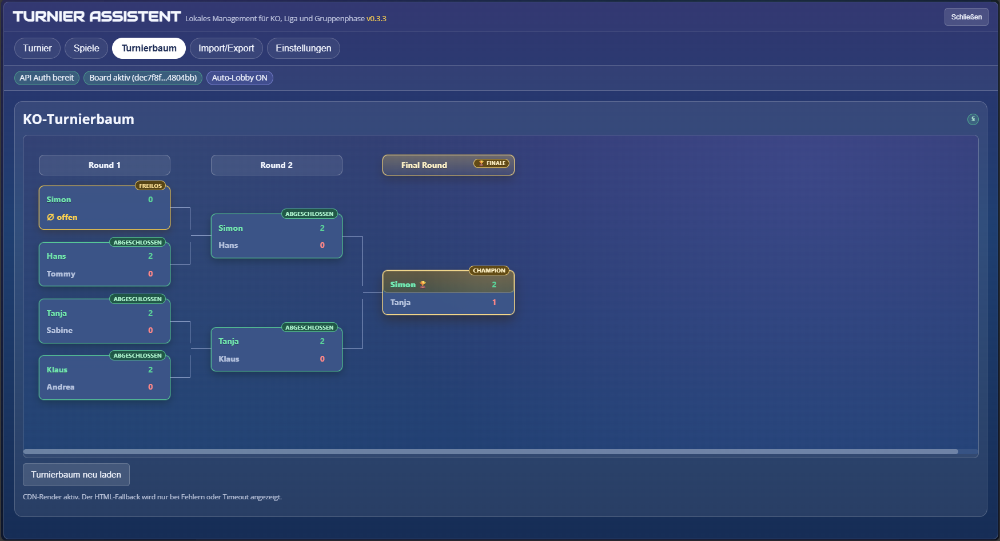

Widok ligi (tabela + harmonogram):

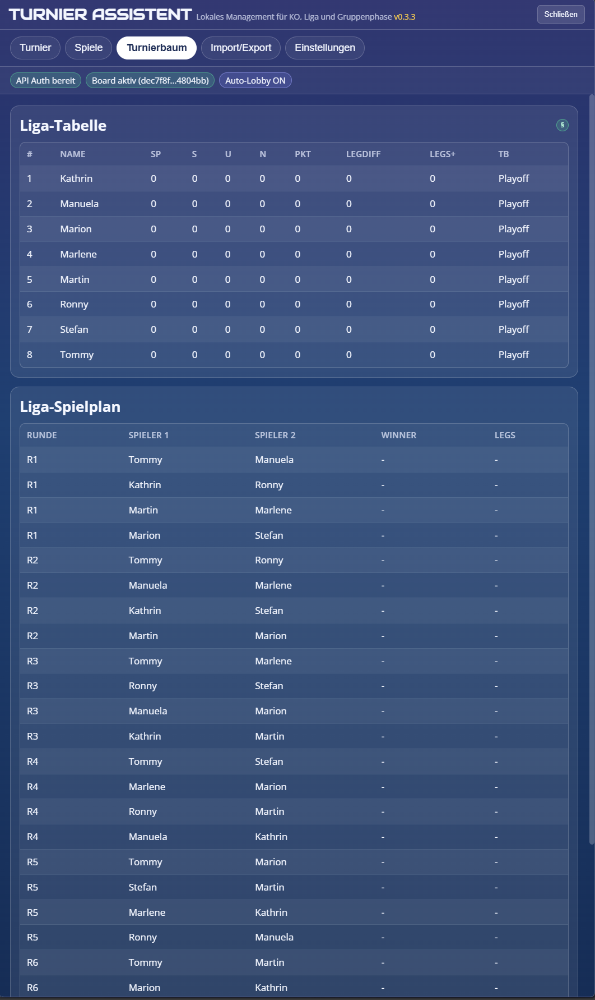

Faza grupowa + KO:

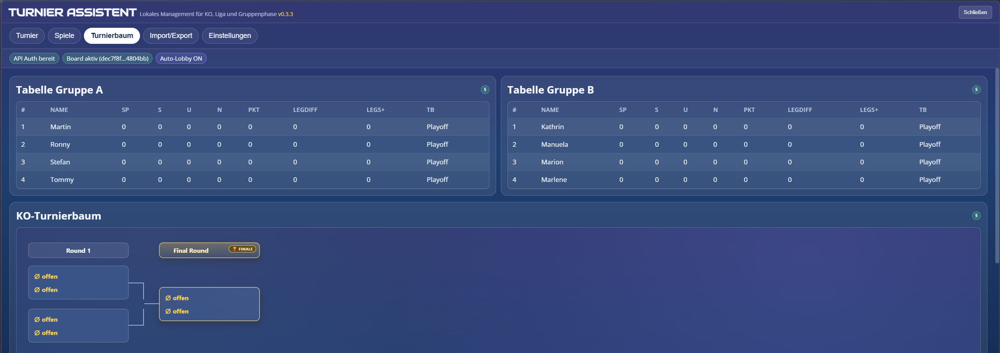

## Import i eksport
Zakładka: `Import/Export`

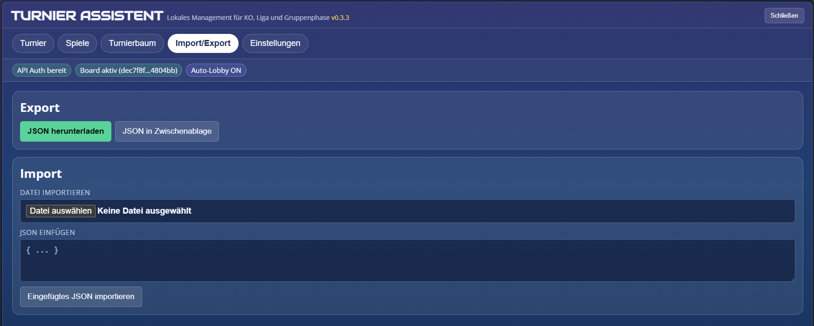

### Eksport
- `Pobierz JSON`
- `Kopiuj JSON do schowka`

### Import
- Import z pliku (`.json`)
- Wklejenie JSON-a jako tekst

### Uwagi dotyczące danych i migracji
- Wersja schematu persystencji: `schemaVersion: 4`
- Podczas importu dane są defensywnie normalizowane.
- Starsze turnieje KO są migrowane do silnika KO v3.
- Przed migracją KO tworzona jest kopia zapasowa pod kluczem  
  `ata:tournament:ko-migration-backups:v2`.
- Istniejące turnieje są normalizowane do:
  `tournament.rules.tieBreakProfile = promoter_h2h_minitable`.

## Ustawienia
Zakładka: `Einstellungen`


### Ikony informacyjne
Legenda dla wyświetlanych ikon pomocy:

| Symbol | Znaczenie | Typowa treść |
|---|---|---|
|  | `Info-Icon` = informacja techniczna | Obsługa, implementacja, kontekst README |
|  | `Regel-Icon` = zasady | Odniesienia do DRA, punkty, strony, wyjaśnienia |

- `Info-Icon` prowadzi do informacji technicznych i dokumentacji projektu.
- `Regel-Icon` prowadzi do głównego wyjaśnienia zasad w  
  [docs/dra-regeln-gui.md](docs/dra-regeln-gui.md).

### Tryb debugowania
- Włącza szczegółowe logi w konsoli przeglądarki.
- Prefiksy np. `[ATA][api]`, `[ATA][bracket]`, `[ATA][storage]`.
- Przydatne przy diagnozowaniu API lub problemów z renderowaniem.

### Automatyczny start lobby + synchronizacja API
- Domyślnie: `WYŁ`.
- Po włączeniu:
  - `Uruchom mecz` tworzy lobby, dodaje graczy i startuje mecz.
  - Wynik jest automatycznie pobierany z API.
- Dlaczego: mniej ręcznych kroków, mniejsze ryzyko błędów w wynikach.

### Losowe mieszanie pierwszej rundy KO (domyślnie)
- Domyślnie: `WŁ`.
- Dotyczy nowo tworzonych turniejów KO.
- `WŁ` → `open_draw` (losowa kolejność w rundzie 1).
- `WYŁ` → `seeded` (kolejność wpisania = seedy).
- Dlaczego: organizator może wybrać między losowaniem a rozstawieniem.

### Blokada drabinki KO (Draw-Lock)
- Domyślnie: `WŁ`.
- Nowe turnieje KO zachowują pierwotną drabinkę (`drawLocked = true`).
- Odniesienie: DRA `6.12.1` — opublikowany draw nie powinien być zmieniany.
- W zakładce `Ustawienia` można odblokować drabinkę dla aktywnego turnieju.
- Dlaczego: zapobiega nieuczciwym lub przypadkowym zmianom drabinki.

### Profil czasu trwania turnieju
- Szczegóły: [docs/tournament-duration.md](docs/tournament-duration.md)
- Profil wpływa na szybkość legów oraz przerwy między meczami.
- Dostępne profile:
  - `Szybki`
  - `Normalny` (zalecany)
  - `Wolny`
- Profil działa jako globalny mnożnik dla prognozy czasu w zakładce `Turnier`.
- Niezależnie od profilu wpływ mają:
  - tryb i liczba uczestników
  - `Best of Legs`
  - `Punkty startowe`
  - `In` / `Out`
  - `Bull-off` / `Tryb bulla`
  - `Max Rund`

### Profil tie-break promotora
- `Promoter H2H + Mini-tabela` (zalecany):
  - Punkty (`2` wygrana, `1` remis, `0` porażka)
  - Bezpośredni pojedynek przy 2 równych punktowo
  - Mini-tabela (różnica legów w podgrupie) przy 3+ równych
  - Następnie różnica legów ogólna i liczba wygranych legów
  - Przy dalszym remisie: `Wymagany playoff`
- `Promotor: punkty + różnica legów`:
  - uproszczona, kompatybilna wersja
  - kolejność: punkty → różnica legów → wygrane legi

Dlaczego to ważne:
- DRA `6.16.1` pozwala organizatorowi ustalić własne tie-breaki.
- Profil zapewnia spójność i przewidywalność tabeli.

## Podstawa zasad i limity

Priorytety przy ustalaniu limitów w tym projekcie:
1. Oficjalne zasady gry w darta
2. Logika matematyczna turniejów
3. Techniczna wykonalność w Userscript

### Oficjalne źródła zasad
- Strona DRA Rulebook: https://www.thedra.co.uk/dra-rulebook
- Kopia PDF w projekcie: [docs/DRA-RULE_BOOK.pdf](docs/DRA-RULE_BOOK.pdf)
- Odniesienia DRA:
  - Definicja „Bye”: sekcja `2` (strona 4)
  - Format KO / Round Robin: `6.8.1`, `6.8.2` (strona 17)
  - Uczestnicy i decyzje organizatora: `6.10.1`, `6.10.5.2` (strony 17–18)
  - Niezmienność drabinki: `6.12.1` (strona 18)
  - Tie‑break według uznania organizatora: `6.16.1` (strona 20)

### Zaimplementowane limity (z uzasadnieniem)
| Tryb | Limit | Dlaczego |
|---|---|---|
| `ko` | `2..128` | Zgodne z zasadami, bez sztucznych ograniczeń; 128 to techniczny limit stabilności UI. |
| `league` | `2..16` | Round Robin rośnie kwadratowo (`n*(n-1)/2`); powyżej 16 robi się zbyt długie i niepraktyczne lokalnie. |
| `groups_ko` | `4..16` | Minimum 4 dla dwóch grup + KO; maksimum wynika z liczby meczów i ergonomii. |

Dodatkowe uwagi:
- Techniczny twardy limit: `128` uczestników.
- GUI podlinkowuje wyjaśnienia zasad przez ikonę reguł do pliku  
  [docs/dra-regeln-gui.md](docs/dra-regeln-gui.md).

### Dlaczego te zasady są ważne dla graczy
- **Przejrzystość:** każdy widzi, dlaczego mecz jest zablokowany lub odblokowany.
- **Fair play:** blokada drabinki i obsługa wolnych losów zapobiegają manipulacjom.
- **Zrozumiałość:** profil tie‑break zapewnia powtarzalne i jasne wyniki tabeli.
- **Praktyczność:** limity chronią przed formatami, których nie da się sensownie przeprowadzić lokalnie.

## Rozwiązywanie problemów (Troubleshooting)

### „Mecz jest zakończony”, mimo że dopiero zaczynam
- Najczęściej powodem jest stary, niespójny stan danych.
- Rozwiązanie:
  1. Odśwież stronę.
  2. Jeśli trzeba — utwórz turniej ponownie.
  3. Sprawdź, czy `Freilos` w rundzie 1 nie został automatycznie oznaczony jako zakończony (to prawidłowe).

### „Board-ID ungültig (manual)”
- Otwórz ręcznie dowolne lobby w Autodarts i ustaw board.
- Następnie odśwież stronę.

### API nie startuje / nie synchronizuje
- Sprawdź login (czy token jest aktywny).
- Czy funkcja automatyczna jest włączona?
- Upewnij się, że nazwy graczy są unikalne.
- Jeśli istnieje kilka otwartych meczów z tą samą parą — wynik **nie** zostanie przejęty (celowo, aby uniknąć błędów).

### Drabinka się nie renderuje
- CDN może być chwilowo niedostępny.
- Wtedy wyświetlany jest fallback HTML.

## Rozwój (Development)

### Struktura repozytorium
```text
autodarts_local_tournament/
|- src/
|  |- core/
|  |- data/
|  |- domain/
|  |- app/
|  |- infra/
|  |- ui/
|  |  |- styles/
|  |  `- render-helpers.js
|  |- bracket/
|  |- runtime/
|- build/
|  |- manifest.json
|  |- version.json
|  `- domain-test-manifest.json
|- scripts/
|  |- build.ps1
|  |- qa.ps1
|  |- qa-architecture.ps1
|  |- qa-build-discipline.ps1
|  |- qa-encoding.ps1
|  |- qa-regelcheck.ps1
|  |- test-domain.ps1
|  `- test-runtime-contract.ps1
|- tests/
|  |- fixtures/
|  |- selftest-runtime.js
|  |- contracts/
|  |- domain-isolation.js
|  |- test-harness.js
|  |- unit-ko-engine.js
|  |- unit-rules-config.js
|  `- unit-standings-dra.js
|- installer/
|  |- Autodarts Turnieje Zasadinho Instalacja.user.js
|- dist/
|  |- autodarts-turnieje-asystent.user.js
|- docs/
|  |- architecture.md
|  |- codebase-map.md
|  |- dra-compliance-matrix.md
|  |- dra-regeln-gui.md
|  |- pdc-dra-compliance.md
|  |- refactor-guide.md
|  |- selector-strategy.md
|  |- changelog.md
|- assets/
|- README.md
|- LICENSE
```


Pełna dokumentacja plików i powiązań znajduje się w  
[docs/codebase-map.md](docs/codebase-map.md).

### Najważniejsze pliki
- Kod źródłowy: `src/*`
- Metadane builda: `build/manifest.json`, `build/version.json`
- Build/QA: `scripts/*.ps1`
- Skrypt runtime: `dist/autodarts-turnieje-asystent.user.js`
- Loader: `installer/Autodarts Turnieje Zasadinho Instalacja.user.js`

### Build i QA
```powershell
powershell -ExecutionPolicy Bypass -File scripts/build.ps1
powershell -ExecutionPolicy Bypass -File scripts/qa.ps1
```

Testy szczegółowe:

```powershell
powershell -ExecutionPolicy Bypass -File scripts/qa-architecture.ps1
powershell -ExecutionPolicy Bypass -File scripts/test-domain.ps1
powershell -ExecutionPolicy Bypass -File scripts/test-runtime-contract.ps1
```


### Architektura
- Shadow DOM dla izolowanego UI
- `src/app/*` jako warstwa pośrednia między domeną, persystencją i UI
- Hooki SPA do stabilnej integracji z Autodarts
- Defensywna normalizacja danych
- Renderowanie drabinki w sandboxowanym iframe
- `src/runtime/*` tylko do bootstrapu i łączenia modułów

## Ograniczenia
- Limity trybów:
  - `ko`: `2..128`
  - `league`: `2..16`
  - `groups_ko`: `4..16`
- Techniczny limit twardy: `128` uczestników
- Półautomatyka API opiera się na praktycznie używanych endpointach (inferencja)
- DOM‑Autodetect działa na zasadzie best‑effort

## Źródła
- Benchmarki czasu trwania turniejów:
  - https://www.aboutthedarts.com/how-to/calculate-the-time-required-for-your-darts-tournament/
  - https://www.bognorregis.com/darts/
  - https://gameandentertain.com/how-long-does-a-game-of-darts-last/
- DRA (oficjalne zasady):
  - https://www.thedra.co.uk/dra-rulebook
  - [docs/DRA-RULE_BOOK.pdf](docs/DRA-RULE_BOOK.pdf)
- PDC (open draw, zasady eventów):
  - https://www.pdc.tv/news/2013/01/16/rules-challenge-youth-tours
- Modularizacja JS:
  - https://developer.mozilla.org/en-US/docs/Web/JavaScript/Guide/Modules
- Dokumentacja Tampermonkey:
  - https://www.tampermonkey.net/documentation.php?locale=en
- FAQ Tampermonkey (injection):
  - https://www.tampermonkey.net/faq.php#Q209
- Referencyjne rozszerzenie:
  - https://chromewebstore.google.com/detail/autodarts-local-tournamen/algfbicoennnolleogigbefngpkkmcng
- Bracket Viewer:
  - https://github.com/Drarig29/brackets-viewer.js
- Inspiracje z motywów Autodarts:
  - https://github.com/thomasasen/autodarts-tampermonkey-themes
