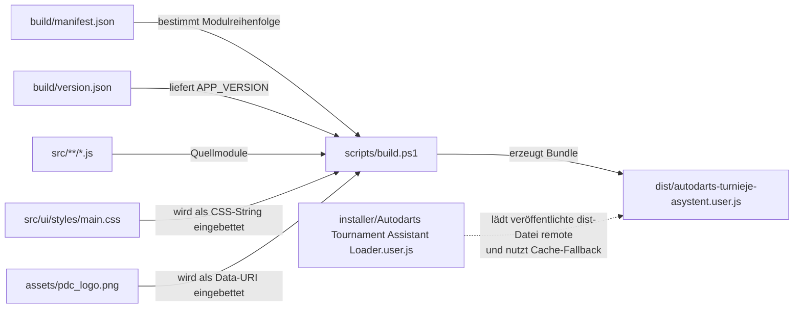
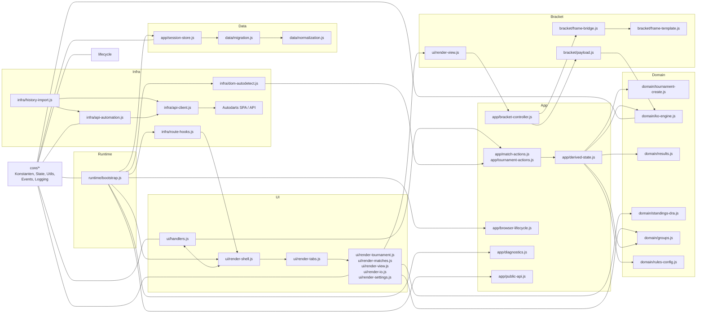

# Techniczna mapa kodu

## Cel i sposób czytania
Ten dokument jest technicznym planem repozytorium. Odpowiada na trzy pytania:

1. Jak projekt jest podzielony na foldery i pliki?
2. Dlaczego dana odpowiedzialność znajduje się właśnie w tym miejscu?
3. W jaki sposób poszczególne pliki współdziałają podczas budowania, działania i utrzymania projektu?

Zalecana kolejność czytania:

1. Do ogólnej logiki warstw najpierw przeczytaj: [architecture.md](architecture.md)
2. Do konkretnej logiki plików i powiązań: ten dokument
3. Do zasad wprowadzania zmian: [refactor-guide.md](refactor-guide.md)
4. Do szczegółów dotyczących DOM i selektorów: [selector-strategy.md](selector-strategy.md)
5. Do odniesień do reguł: [pdc-dra-compliance.md](pdc-dra-compliance.md) oraz [dra-compliance-matrix.md](dra-compliance-matrix.md)


Skupienie tutaj jest celowo położone na organizacji kodu, ścieżce budowania, przepływie działania oraz rolach poszczególnych plików skryptowych. Ten dokument jest więc szczegółowym uzupełnieniem krótszego pliku [architecture.md](architecture.md).

## Dlaczego podział wygląda właśnie tak
- `src/core`: wspólne prymitywy, stałe, stan, logowanie i małe funkcje pomocnicze znajdują się w jednym miejscu, ponieważ userscript jest bundlowany do jednego pliku według stałej kolejności manifestu i potrzebuje stabilnej technicznej bazy.
- `src/data`: persystencja, normalizacja i migracje są oddzielone od UI i logiki domenowej, aby import, eksport, dane legacy i zmiany schematu były kontrolowalne.
- `src/domain`: reguły turniejowe są oddzielone od DOM i API, aby logika KO, grupowa, ligowa i wynikowa była zrozumiała, testowalna i niezależna od zmian w interfejsie Autodarts.
- `src/app`: orkiestracja między czystą logiką domenową, persystencją, ponownym renderowaniem UI i sterowaniem bracketem znajduje się w osobnej warstwie, aby funkcje domenowe pozostały czyste, a efekty uboczne miały jednoznaczne miejsce.
- `src/infra`: wszystkie zewnętrzne zależności Autodarts są izolowane, aby zmiany w endpointach API, autoryzacji lub SPA-routing nie przenikały do logiki domenowej.
- `src/ui`: rendering i logika obsługi są rozdzielone. Pliki renderujące dostarczają HTML dla poszczególnych zakładek, a `handlers.js` jest wejściem UI i deleguje działania domenowe do `src/app/*`.
- `src/bracket`: renderowanie bracketu z biblioteki zewnętrznej jest celowo enkapsulowane, ponieważ działa w izolowanym `iframe` z własnym message-bridge i fallbackiem HTML; stan UI i komunikaty nie znajdują się już w folderze bracket.
- `src/runtime`: pozostaje jedynie jako warstwa bootstrap/wiring; właściwa logika przeglądarkowa i publiczne API po refaktorze znajdują się w `src/app/*` oraz `src/infra/*`.
- `scripts`, `build`, `installer`, `dist`, `tests`: workflow deweloperski, artefakty builda, loader, finalny bundle i testy referencyjne są oddzielone, aby kod źródłowy, narzędzia i dystrybucja nie mieszały się.

Podział jest więc nie tylko wizualnie modularny, ale świadomie oddziela:

- techniczną bazę od reguł domenowych
- lokalną persystencję od zewnętrznego API
- generowanie HTML od zmian stanu
- źródło prawdy od artefaktów generowanych

## Mapa repozytorium
```text
autodarts_local_tournament/
|- src/
|  |- core/
|  |  |- constants.js
|  |  |- state.js
|  |  |- utils.js
|  |  |- logging.js
|  |  `- events.js
|  |- data/
|  |  |- storage.js
|  |  |- normalization.js
|  |  `- migration.js
|  |- domain/
|  |  |- match-state.js
|  |  |- rules-config.js
|  |  |- tournament-create.js
|  |  |- tournament-duration.js
|  |  |- standings-dra.js
|  |  |- groups.js
|  |  |- ko-engine.js
|  |  `- results.js
|  |- app/
|  |  |- notifications.js
|  |  |- session-store.js
|  |  |- derived-state.js
|  |  |- match-actions.js
|  |  |- tournament-actions.js
|  |  |- match-view-models.js
|  |  |- bracket-controller.js
|  |  |- browser-lifecycle.js
|  |  |- diagnostics.js
|  |  `- public-api.js
|  |- infra/
|  |  |- api-client.js
|  |  |- api-automation.js
|  |  |- dom-autodetect.js
|  |  |- history-import.js
|  |  `- route-hooks.js
|  |- ui/
|  |  |- render-helpers.js
|  |  |- render-shell.js
|  |  |- render-tabs.js
|  |  |- render-tournament.js
|  |  |- render-matches.js
|  |  |- render-view.js
|  |  |- render-io.js
|  |  |- render-settings.js
|  |  |- handlers.js
|  |  `- styles/
|  |     `- main.css
|  |- bracket/
|  |  |- payload.js
|  |  |- frame-template.js
|  |  `- frame-bridge.js
|  `- runtime/
|     |- lifecycle.js
|     |- public-api.js
|     `- bootstrap.js
|- build/
|  |- manifest.json
|  |- version.json
|  `- domain-test-manifest.json
|- scripts/
|  |- build.ps1
|  |- qa.ps1
|  |- qa-architecture.ps1
|  |- qa-build-discipline.ps1
|  |- qa-encoding.ps1
|  |- qa-regelcheck.ps1
|  |- test-domain.ps1
|  `- test-runtime-contract.ps1
|- tests/
|  |- contracts/
|  |- selftest-runtime.js
|  |- test-harness.js
|  |- domain-isolation.js
|  |- unit-ko-engine.js
|  |- unit-tournament-duration.js
|  |- unit-rules-config.js
|  `- unit-standings-dra.js
|  `- fixtures/
|     |- group-deadlock-playoff.json
|     |- ko-seeded-9.json
|     `- migration-v2-to-v3.json
|- installer/
|  `- Autodarts Turnieje Zasadinho Instalacja.user.js
|- dist/
|  `- autodarts-turnieje-asystant.user.js
|- docs/
|  |- architecture.md
|  |- codebase-map.md
|  |- refactor-guide.md
|  |- selector-strategy.md
|  |- pdc-dra-compliance.md
|  |- dra-compliance-matrix.md
|  |- dra-regeln-gui.md
|  |- changelog.md
|  `- DRA-RULE_BOOK.pdf
|- assets/
|  |- Screenshots fuer README und Docs
|  |- pdc_logo.png
|  `- ata-export-*.json
|- README.md
`- LICENSE
```

## Ścieżka budowania i dystrybucji
Proces budowania pozostaje celowo prosty: bez npm, bez bundlerów, bez pakietów pośrednich. Zamiast tego moduły źródłowe są odczytywane w kolejności z `build/manifest.json`, łączone w jeden plik userscriptu i wzbogacane o osadzone CSS oraz osadzone logo PDC.

Praktyczny przebieg:

1. `build/manifest.json` definiuje kolejność plików źródłowych.
2. `build/version.json` jest centralnym źródłem wersji dla bundla runtime.
3. `scripts/build.ps1` odczytuje te pliki, ładuje każdy moduł, usuwa stare znaczniki split i łączy zawartość.
4. To samo skrypt wstrzykuje wersję aplikacji oraz `src/ui/styles/main.css` i `assets/pdc_logo.png` bezpośrednio do bundla.
5. Wynik trafia jako jedyny plik do dystrybucji: `dist/autodarts-turnieje-asystent.user.js`.
6. Loader w `installer/Autodarts Turnieje Zasadinho Instalacja.user.js` ładuje tę opublikowaną dist‑wersję zdalnie i w razie potrzeby korzysta z cache jako fallbacku.



Ważne przy tym:

- `dist/*` to artefakt, a nie źródło prawdy.
- `constants.js` zawiera początek userscriptu, włącznie z nagłówkiem i początkiem IIFE.
- `bootstrap.js` domyka cały bundle jako ostatni plik.
- Jeśli dodajesz nowy moduł źródłowy, musi istnieć nie tylko plik, ale także poprawna kolejność w manifeście.

## Przepływ działania (runtime) i danych
W czasie działania dzieje się więcej niż tylko renderowanie UI. Userscript ładuje persystencję, renderuje interfejs w Shadow DOM, monitoruje single‑page‑app Autodarts, opcjonalnie uruchamia automatyzację API, wykrywa strony historii i synchronizuje renderowanie bracketu w `iframe`.

Główny łańcuch wygląda tak:

1. `src/runtime/bootstrap.js` uruchamia `init()`.
2. `src/app/session-store.js` ładuje, migruje i zapisuje przechowywany stan.
3. `src/ui/handlers.js` tworzy host i shell w Shadow DOM.
4. `src/app/browser-lifecycle.js`, `src/infra/dom-autodetect.js`, `src/infra/history-import.js` oraz `src/infra/route-hooks.js` obserwują DOM, trasy SPA i strony historii.
5. `src/infra/api-automation.js` współpracuje z `src/infra/api-client.js` z API Autodarts, jeśli odpowiednia flaga funkcji jest aktywna.
6. `src/ui/render-view.js` uruchamia dla widoków KO renderowanie bracketu poprzez `src/app/bracket-controller.js` i `src/bracket/*`.
7. `src/app/public-api.js` udostępnia `window.__ATA_RUNTIME`, a `src/app/diagnostics.js` utrzymuje autotesty runtime.



Ważne powiązania krzyżowe:

- `core/utils.js` oraz `data/normalization.js` to elementy przekrojowe, dlatego pojawiają się pośrednio w wielu miejscach.
- `src/app/*` jest centralnym węzłem między akcją użytkownika, persystencją, logiką domenową, sterowaniem bracketem i ponownym renderowaniem.
- `domain/ko-engine.js` pozostaje silnikiem logiki turniejowej dla progresji, byes, blokady losowania i pochodnych meczów KO — ale bez efektów ubocznych związanych z persystencją lub logowaniem.
- `infra/dom-autodetect.js` i `infra/history-import.js` łączą DOM Autodarts oraz strony historii z lokalnym stanem turnieju.

## Katalog plików według folderów
Poniższe tabele opisują dla każdego pliku:

- co plik zawiera
- dlaczego znajduje się w tym folderze
- z którymi sąsiednimi plikami współpracuje najczęściej

### Build i dystrybucja

| Plik | Rola | Kluczowa zawartość / główne funkcje | Główne powiązania |
|---|---|---|---|
| `build/manifest.json` | kontrakt kolejności bundla | wymienia wszystkie moduły `src/*.js` w deterministycznej kolejności | `scripts/build.ps1`, `src/core/constants.js`, `src/runtime/bootstrap.js` |
| `build/version.json` | centralne źródło wersji | dostarcza `APP_VERSION` dla nagłówka i runtime | `scripts/build.ps1`, `src/core/constants.js`, `dist/autodarts-turnieje-asystent.user.js` |
| `build/domain-test-manifest.json` | kontrakt testowego bundla | definiuje, które pliki są ładowane do izolowanego domain‑harness | `scripts/test-domain.ps1`, `tests/test-harness.js`, `tests/unit-*.js` |
| `scripts/build.ps1` | orkiestracja builda | czyta manifest i wersję, łączy moduły, wstrzykuje wersję, osadza CSS i logo, zapisuje `dist/*` | `build/manifest.json`, `build/version.json`, `src/ui/styles/main.css`, `assets/pdc_logo.png`, `dist/autodarts-turnieje-asystent.user.js` |
| `scripts/qa.ps1` | pełne QA | uruchamia build, QA architektury, encoding, sprawdzanie reguł, domain‑harness, runtime‑contract i dyscyplinę builda | `scripts/build.ps1`, `scripts/qa-architecture.ps1`, `scripts/test-domain.ps1`, `scripts/test-runtime-contract.ps1`, `scripts/qa-build-discipline.ps1` |
| `scripts/qa-architecture.ps1` | bramka architektury | sprawdza czystość domeny, granice runtime/bracket/storage oraz reguły rendererów UI | `src/domain/*`, `src/bracket/*`, `src/data/storage.js`, `src/runtime/*`, `src/ui/render-*.js` |
| `scripts/qa-encoding.ps1` | kontrola znaków i terminologii | sprawdza UTF‑8, mojibake i kluczowe pojęcia UI w źródłach, dist i dokumentacji | `src/*`, `dist/autodarts-turnieje-asystent.user.js`, `docs/*`, `README.md` |
| `scripts/qa-regelcheck.ps1` | fachowy regex‑check | sprawdza w `dist/*`, czy kluczowe mapowania reguł, logika KO i terminologia występują w bundlu | `dist/autodarts-turnieje-asystent.user.js`, logika domenowa z `src/domain/*` |
| `scripts/test-domain.ps1` | izolowany domain‑harness | buduje testowy bundle bez zależności i uruchamia go w headless‑browser | `build/domain-test-manifest.json`, `tests/test-harness.js`, `tests/domain-isolation.js`, `tests/unit-*.js` |
| `scripts/test-runtime-contract.ps1` | test kontraktu runtime | ładuje `dist/*` w headless‑browser i sprawdza `window.__ATA_RUNTIME` oraz `runSelfTests()` | `dist/autodarts-turnieje-asystent.user.js`, `tests/contracts/*` |
| `scripts/qa-build-discipline.ps1` | dyscyplina builda | sprawdza placeholdery, wstrzyknięcie wersji i wygenerowane `dist/*` | `build/version.json`, `src/core/constants.js`, `dist/autodarts-turnieje-asystent.user.js` |
| `installer/Autodarts Turnieje Zasadinho Instalacja.user.js` | skrypt loadera, nie logika aplikacji | ładuje opublikowaną dist‑wersję zdalnie, waliduje ją, cache’uje i tworzy wpis w menu | `dist/autodarts-turnieje-asystent.user.js`, GitHub Raw URL, Tampermonkey GM APIs |
| `dist/autodarts-turnieje-asystent.user.js` | wygenerowany artefakt dystrybucyjny | zawiera cały userscript jako jeden plik; kompatybilny z loaderem i gotowy do instalacji | `scripts/build.ps1`, `installer/Autodarts Turnieje Zasadinho Instalacja.user.js`, przeglądarka/Tampermonkey |

### Testy

| Plik | Rola | Kluczowa zawartość / główne funkcje | Główne powiązania |
|---|---|---|---|
| `tests/contracts/runtime-api-contract.js` | kontrakt API | definiuje oczekiwane klucze i nazwy funkcji Runtime API | `scripts/test-runtime-contract.ps1`, `window.__ATA_RUNTIME` |
| `tests/contracts/globals-contract.js` | kontrakt globali | definiuje oczekiwane globalne ATA oraz zabronione nowe klucze | `scripts/test-runtime-contract.ps1`, globalny obiekt przeglądarki |
| `tests/test-harness.js` | minimalny test‑runner | rejestruje testy, asercje i agregację wyników dla no‑deps harness | `scripts/test-domain.ps1`, `tests/domain-isolation.js`, `tests/unit-*.js` |
| `tests/domain-isolation.js` | testy izolacji | sprawdza, że funkcje domenowe działają bez runtime‑state, DOM‑mocków i persystencji | `src/domain/*`, `tests/test-harness.js` |
| `tests/unit-ko-engine.js` | testy jednostkowe KO | sprawdza Seeded‑9, Draw‑Lock, Winner‑Advancement i KO‑Migration v3 | `src/domain/ko-engine.js`, `src/domain/tournament-create.js`, `tests/test-harness.js` |
| `tests/unit-rules-config.js` | testy jednostkowe reguł | sprawdza czyste mutacje Tie‑Break i Draw‑Lock | `src/domain/rules-config.js`, `tests/test-harness.js` |
| `tests/unit-standings-dra.js` | testy jednostkowe klasyfikacji | sprawdza H2H/mini‑tabelę, profil legacy i `playoff_required` | `src/domain/standings-dra.js`, `tests/test-harness.js` |
| `tests/selftest-runtime.js` | pomocnik konsoli przeglądarki | wywołuje `window.__ATA_RUNTIME.runSelfTests()` i formatuje wynik dla `console.table` | `src/app/diagnostics.js`, `dist/autodarts-turnieje-asystent.user.js` |

### Core

| Plik | Rola | Kluczowa zawartość / główne funkcje | Główne powiązania |
|---|---|---|---|
| `src/core/constants.js` | techniczny punkt wejścia bundla | nagłówek userscriptu, start IIFE, globalne klucze, URL‑e, konfiguracja, stałe opcje i pojęcia | `build/manifest.json`, wszystkie kolejne `src/*`, `src/runtime/bootstrap.js` |
| `src/core/state.js` | centralny stan runtime | przechowuje stan drawerów, zakładek, powiadomień, bracketu, API, obserwatorów i store | `src/core/utils.js`, `src/data/normalization.js`, `src/data/storage.js`, `src/ui/handlers.js` |
| `src/core/utils.js` | pomocniki przekrojowe | sanitizacja, HTML‑escaping, ID, losowość, parsowanie uczestników, routing‑key | `src/data/normalization.js`, `src/domain/*`, `src/ui/*`, `src/infra/*`, `src/runtime/*` |
| `src/core/logging.js` | debug i logowanie błędów | `logDebug`, `logWarn`, `logError` z prefiksami ATA | `src/data/storage.js`, `src/domain/ko-engine.js`, `src/infra/*`, `src/runtime/*`, `src/ui/handlers.js` |
| `src/core/events.js` | narzędzia lifecycle i cleanup | centralnie rejestruje cleanup, listenery, intervale i obserwatorów | `src/infra/route-hooks.js`, `src/runtime/bootstrap.js`, `src/runtime/lifecycle.js`, `src/runtime/public-api.js` |

### Data

| Plik | Rola | Kluczowa zawartość / główne funkcje | Główne powiązania |
|---|---|---|---|
| `src/data/storage.js` | I/O persystencji | odczyt i zapis GM/localStorage bez orkiestracji | `src/data/migration.js`, `src/app/session-store.js` |
| `src/data/normalization.js` | normalizacja formatu i store | domyślny store, domyślny draft, sanitizacja, normalizacja turniejów/meczów/KO, helpery lookup, limity | `src/core/utils.js`, `src/domain/tournament-create.js`, `src/data/storage.js`, pliki renderujące i domenowe |
| `src/data/migration.js` | migracja schematu i danych | migruje stare zapisy, normalizuje obiekty reguł, tworzy backupy migracji KO | `src/data/storage.js`, `src/data/normalization.js`, `src/domain/ko-engine.js`, `src/runtime/public-api.js` |

Trzy pliki razem tworzą pełny przepływ persystencji:

`odczyt -> migracja -> normalizacja -> trzymanie w stanie -> zapis`

### Domain

| Plik | Rola | Kluczowa zawartość / główne funkcje | Główne powiązania |
|---|---|---|---|
| `src/domain/match-state.js` | wspólne mutacje meczu | `clearMatchResult()` i `assignPlayerSlot()` jako czyste helpery meczowe | `src/domain/ko-engine.js`, `src/domain/groups.js`, `src/domain/results.js` |
| `src/domain/rules-config.js` | czyste mutacje reguł | zmienia profil tie-break i KO-draw-lock wyłącznie na przekazanym obiekcie turnieju | `src/data/normalization.js`, `src/app/tournament-actions.js` |
| `src/domain/tournament-create.js` | czysta logika tworzenia turnieju | fabryka meczów, pairingi round-robin, logika seedów i byes, tworzenie grup, struktura KO, walidacja, `createTournament` | `src/data/normalization.js`, `src/domain/ko-engine.js`, `src/app/tournament-actions.js`, `src/app/diagnostics.js` |
| `src/domain/tournament-duration.js` | czysta prognoza czasu | oblicza liczbę meczów, oczekiwane legi, czas meczu i zakres czasowy turnieju — bez zależności od DOM lub stanu | `src/data/normalization.js`, `src/domain/tournament-create.js`, `src/ui/render-tournament.js`, `src/ui/render-settings.js`, `tests/unit-tournament-duration.js` |
| `src/domain/standings-dra.js` | silnik tabeli i tie-breaków | oblicza punkty, różnice legów, bezpośrednie starcia, mini‑tabelę i `playoff_required` | `src/data/normalization.js`, `src/domain/groups.js`, `src/ui/render-view.js`, `src/runtime/public-api.js` |
| `src/domain/groups.js` | przejście z grup do KO | oblicza tabele grupowe i przy `groups_ko` wypełnia sloty półfinałów KO | `src/domain/standings-dra.js`, `src/domain/ko-engine.js`, `src/ui/render-view.js` |
| `src/domain/ko-engine.js` | silnik KO | advancement zwycięzców, draw-lock, byes, snapshoty KO, migracja v3 i walidacja wyników — bez efektów ubocznych persystencji/logowania | `src/data/normalization.js`, `src/domain/groups.js`, `src/domain/tournament-create.js`, `src/domain/match-state.js`, `src/app/derived-state.js` |
| `src/domain/results.js` | czysta logika wyników | wyszukiwanie otwartych meczów, walidacja legów, wyznaczanie zwycięzcy, zapisywanie wyników w przekazanym turnieju, określanie edytowalności | `src/domain/tournament-create.js`, `src/domain/ko-engine.js`, `src/app/match-actions.js`, `src/infra/api-automation.js` |

Tutaj znajduje się właściwa logika turniejowa. Jeśli zmienia się reguła merytoryczna, `src/domain/*` jest prawie zawsze pierwszym miejscem do sprawdzenia.

### App

| Plik | Rola | Kluczowa zawartość / główne funkcje | Główne powiązania |
|---|---|---|---|
| `src/app/notifications.js` | orkiestracja powiadomień | centralne `setNotice()` z timerem i re-renderem | `src/ui/render-shell.js`, `src/ui/handlers.js`, `src/infra/*`, `src/app/*` |
| `src/app/session-store.js` | orkiestracja session-store | `loadPersistedStore()`, `schedulePersist()`, `persistStore()` | `src/data/storage.js`, `src/data/migration.js`, `src/app/derived-state.js`, `src/runtime/bootstrap.js` |
| `src/app/derived-state.js` | stan turnieju pochodny | centralny workflow odświeżania dla migracji KO, przejścia grup → KO, synchronizacji bracketu i indeksu wyników | `src/domain/groups.js`, `src/domain/ko-engine.js`, `src/domain/results.js`, `src/data/migration.js` |
| `src/app/match-actions.js` | orkiestracja meczów | stateful wrapper dla `updateMatchResult()` z persystencją i re-renderem | `src/domain/results.js`, `src/app/derived-state.js`, `src/app/session-store.js` |
| `src/app/tournament-actions.js` | orkiestracja turnieju | tworzenie, import, reset, zmiany tie-break i draw-lock w aktywnym turnieju | `src/domain/tournament-create.js`, `src/domain/rules-config.js`, `src/app/derived-state.js`, `src/ui/handlers.js` |
| `src/app/match-view-models.js` | view‑modele meczów blisko UI | sortowanie, priorytetyzacja i „Następny mecz” poza rendererem | `src/domain/results.js`, `src/infra/api-automation.js`, `src/ui/render-matches.js` |
| `src/app/bracket-controller.js` | orkiestracja bracketu | kolejka renderów, timeouty, synchronizacja wysokości, fallback widoczności i obsługa błędów | `src/bracket/frame-bridge.js`, `src/bracket/payload.js`, `src/ui/render-view.js` |
| `src/app/browser-lifecycle.js` | lifecycle przeglądarki | cleanup, event‑bridge i helpery UI blisko runtime | `src/infra/history-import.js`, `src/app/bracket-controller.js`, `src/runtime/bootstrap.js` |
| `src/app/diagnostics.js` | diagnostyka runtime | `runSelfTests()` dla konsoli przeglądarki i testu kontraktowego | `src/domain/*`, `src/infra/*`, `src/app/public-api.js`, `scripts/test-runtime-contract.ps1` |
| `src/app/public-api.js` | publiczne API runtime | udostępnia `window.__ATA_RUNTIME` i podpina cleanup | `src/app/diagnostics.js`, `src/runtime/bootstrap.js`, konsola przeglądarki |

### Infra

| Plik | Rola | Kluczowa zawartość / główne funkcje | Główne powiązania |
|---|---|---|---|
| `src/infra/api-client.js` | cienka warstwa bazowa API | odczytuje token autoryzacji i ID boarda, buduje informacje paska statusu, kapsułkuje HTTP‑requesty i endpointy Autodarts | `src/ui/render-shell.js`, `src/infra/api-automation.js`, `src/app/diagnostics.js` |
| `src/infra/api-automation.js` | start meczów i synchronizacja wyników | tworzy lobby, dodaje graczy, startuje mecze, synchronizuje wyniki z API i rozwiązuje przypadki przypisań | `src/infra/api-client.js`, `src/app/match-actions.js`, `src/app/session-store.js`, `src/app/notifications.js`, `src/ui/handlers.js`, `src/infra/history-import.js` |
| `src/infra/dom-autodetect.js` | automatyczne wykrywanie na podstawie DOM | wykrywa aktywne strony meczowe i próbuje przejąć wynik z DOM | `src/app/match-actions.js`, `src/app/notifications.js`, `src/runtime/bootstrap.js` |
| `src/infra/history-import.js` | import historii | parsowanie statystyk, przypisywanie meczów na `/history/matches/{id}` i UI importu inline | `src/infra/api-automation.js`, `src/app/match-actions.js`, `src/app/session-store.js`, `src/app/notifications.js` |
| `src/infra/route-hooks.js` | integracja SPA | patchuje `history.pushState` i `replaceState`, reaguje na zmiany tras i wywołuje re-render | `src/core/events.js`, `src/ui/handlers.js`, `src/infra/history-import.js` |

### UI

| Plik | Rola | Kluczowa zawartość / główne funkcje | Główne powiązania |
|---|---|---|---|
| `src/ui/render-shell.js` | zewnętrzna ramka drawera | renderuje shell Shadow DOM, zakładki, powiadomienia i pasek statusu runtime | `src/ui/render-tabs.js`, `src/infra/api-client.js`, `src/ui/handlers.js` |
| `src/ui/render-tabs.js` | dystrybutor zakładek | decyduje, który renderer zakładki ma zostać uruchomiony | `src/ui/render-tournament.js`, `src/ui/render-matches.js`, `src/ui/render-view.js`, `src/ui/render-io.js`, `src/ui/render-settings.js` |
| `src/ui/render-helpers.js` | helpery UI | `renderInfoLinks()`, helpery sekcji i czasu turnieju dla wielokrotnego użycia | `src/ui/render-*.js` |
| `src/ui/render-tournament.js` | tworzenie i przegląd turnieju | renderuje formularz nowego turnieju, wybór presetów z uczciwymi wskazówkami PDC, prognozę czasu na żywo, aktywny turniej i sekcję resetu | `src/data/normalization.js`, `src/domain/tournament-duration.js`, `src/ui/render-helpers.js`, `src/ui/handlers.js` |
| `src/ui/render-matches.js` | lista meczów i akcje meczowe | renderuje edytory, statusy i przyciski startu API; sortowanie i „Następny mecz” pochodzą z `src/app/match-view-models.js` | `src/app/match-view-models.js`, `src/domain/results.js`, `src/infra/api-automation.js` |
| `src/ui/render-view.js` | widok tabel i bracketu | renderuje tabele ligowe/grupowe, fallback‑bracket i wejście do bracketu w iframe | `src/domain/standings-dra.js`, `src/domain/groups.js`, `src/domain/ko-engine.js`, `src/bracket/*` |
| `src/ui/render-io.js` | zakładka import/eksport | renderuje interfejs eksportu i importu | `src/ui/handlers.js`, `src/data/storage.js` |
| `src/ui/render-settings.js` | zakładka ustawień | renderuje debug‑flag, automatyzację API, domyślne KO, profil czasu, profil tie‑break i wskazówki dot. storage | `src/data/normalization.js`, `src/domain/tournament-duration.js`, `src/ui/render-helpers.js`, `src/ui/handlers.js` |
| `src/ui/handlers.js` | orkiestrator UI | tworzy host, renderuje shell, wiąże eventy, odczytuje formularze, aktualizuje prognozę czasu i deleguje akcje turniejowe/meczowe do `src/app/*` | `src/ui/render-shell.js`, `src/app/tournament-actions.js`, `src/app/match-actions.js`, `src/infra/api-automation.js`, `src/app/bracket-controller.js`, `src/domain/tournament-duration.js` |

`handlers.js` to plik, w którym spotykają się obsługa UI, zmiana stanu i re-render. Pliki renderujące pozostają w dużej mierze deklaratywne.

### Bracket

| Plik | Rola | Kluczowa zawartość / główne funkcje | Główne powiązania |
|---|---|---|---|
| `src/bracket/payload.js` | adapter danych dla viewer’a | tłumaczy wewnętrzne mecze KO na format danych bracket‑viewera | `src/domain/ko-engine.js`, `src/domain/tournament-create.js`, `src/data/normalization.js`, `src/ui/render-view.js` |
| `src/bracket/frame-template.js` | izolowany renderer iframe | generuje pełne `srcdoc` z assetami CDN, stylami, protokołem PostMessage i logiką fallbacku | `src/bracket/frame-bridge.js`, zewnętrzne assety `brackets-viewer` |
| `src/bracket/frame-bridge.js` | niskopoziomowy most parent → iframe | obsługuje reset frame’u, helpery timeoutów, dopasowanie wysokości i transport PostMessage bez stanu UI | `src/bracket/frame-template.js`, `src/app/bracket-controller.js` |

### Runtime

| Plik | Rola | Kluczowa zawartość / główne funkcje | Główne powiązania |
|---|---|---|---|
| `src/runtime/lifecycle.js` | placeholder wiring | pozostaje celowo pustym plikiem runtime w manifeście, aby runtime pozostał wyłącznie bootstrapowy | `build/manifest.json`, reguły architektury |
| `src/runtime/public-api.js` | placeholder wiring | pozostaje celowo pustym plikiem runtime; właściwe API znajduje się w `src/app/public-api.js` | `build/manifest.json`, reguły architektury |
| `src/runtime/bootstrap.js` | punkt startowy userscriptu | ładuje store, renderuje UI, instaluje hooki, lifecycle przeglądarki i intervale, ustawia status runtime‑ready | `src/app/session-store.js`, `src/ui/handlers.js`, `src/app/browser-lifecycle.js`, `src/infra/route-hooks.js`, `src/infra/dom-autodetect.js`, `src/app/public-api.js` |

## Pliki wspierające i materiały referencyjne

### `src/ui/styles/main.css`
- zawiera pełne stylowanie UI w Shadow DOM
- nie jest dostarczany osobno — `scripts/build.ps1` osadza go bezpośrednio w bundlu
- dlatego jest materiałem źródłowym, ale nie stanowi osobnego punktu ładowania w runtime

### `tests/fixtures/*.json`
- `group-deadlock-playoff.json`: przypadek referencyjny dla nierozwiązywalnych remisów w grupach
- `ko-seeded-9.json`: przypadek referencyjny dla KO‑seeding z 9 uczestnikami i dokładnie jednym otwartym meczem w rundzie 1
- `migration-v2-to-v3.json`: przypadek referencyjny dla migracji KO do silnika v3

Te pliki nie zawierają aktywnej logiki, ale są kluczowe, aby specjalne przypadki domenowe były powtarzalne i testowalne.

### `assets/*`
- zrzuty ekranu do README i dokumentacji
- `pdc_logo.png` dla odznaki PDC w bundlu
- przykładowy eksport `ata-export-*.json` jako materiał referencyjny

Assets objaśniają produkt i częściowo zasilają proces builda, ale nie zawierają logiki runtime.

### `docs/DRA-RULE_BOOK.pdf`
- lokalna referencja zasad w repozytorium
- służy jako dokumentacyjna podstawa dla materiałów związanych z DRA/PDC
- nie jest operacyjnym plikiem projektu

## Wskazówki dotyczące utrzymania i przyszłych zmian
- Nowe moduły źródłowe zawsze dodawaj również do `build/manifest.json`. Ten plik nie jest tylko dokumentacyjny — steruje realną kolejnością bundla.
- Nie edytuj ręcznie `dist/autodarts-turnieje-asystent.user.js`. Zmiany należy wprowadzać w `src/*`, `src/ui/styles/main.css` lub `assets/*`.
- Nowe reguły domenowe zawsze umieszczaj najpierw w `src/domain/*`, a nie w plikach renderujących lub warstwach API.
- Nowe pola persystencji wprowadzaj z uwzględnieniem `src/data/normalization.js` i `src/data/migration.js`.
- Jeśli zmieniasz linki pomocy UI, pojęcia reguł lub punkty wejścia dokumentacji, sprawdź również `README.md`, `docs/architecture.md` oraz ewentualnie `docs/dra-regeln-gui.md`.
- Przy zmianach w API lub wykrywaniu DOM pamiętaj o aktualizacji `docs/selector-strategy.md` oraz synchronizacji plików w `app` i `infra`.
- Für strukturelle Änderungen immer auch `scripts/qa-architecture.ps1`, `scripts/test-domain.ps1` und `scripts/test-runtime-contract.ps1` ausführen.
- Für reine Doku-Änderungen reicht in der Regel `scripts/qa-encoding.ps1`; `scripts/qa.ps1` baut zusätzlich `dist/*` neu und ist nur nötig, wenn inhaltlich auch Runtime-Code betroffen ist.
